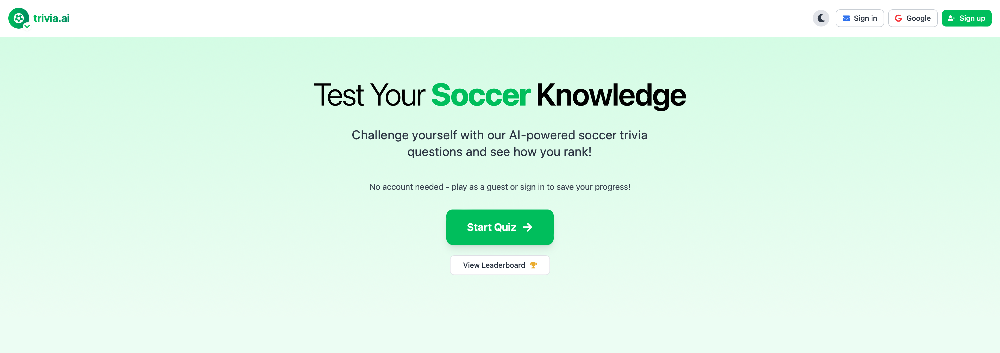
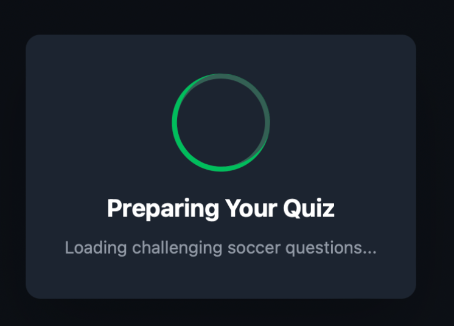
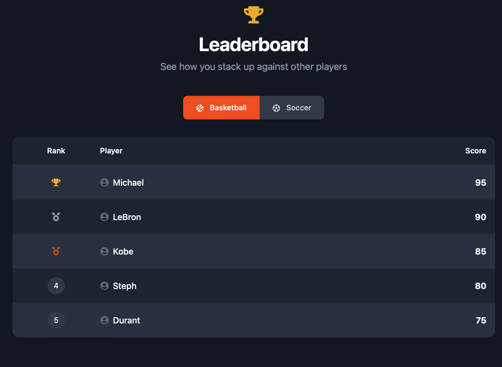
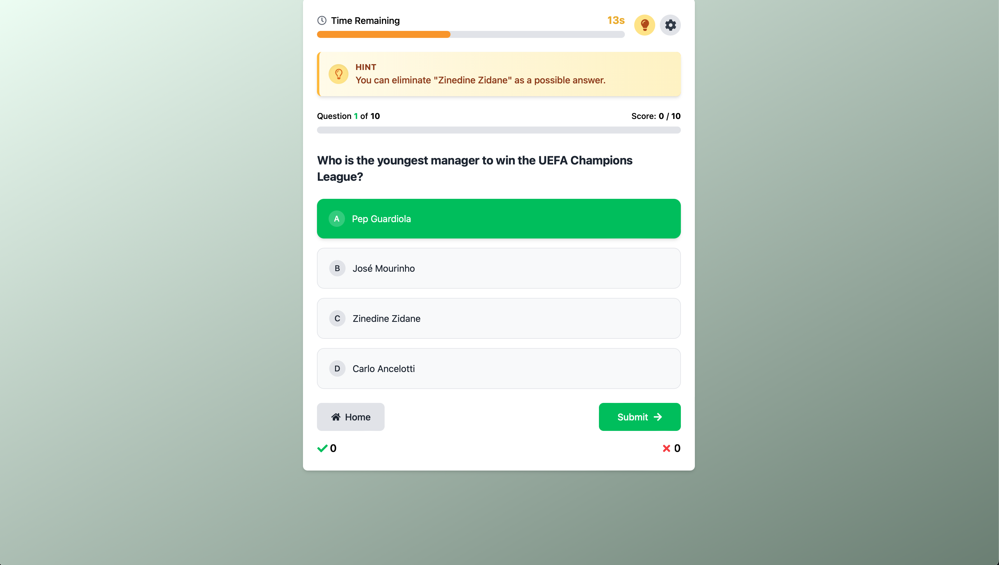
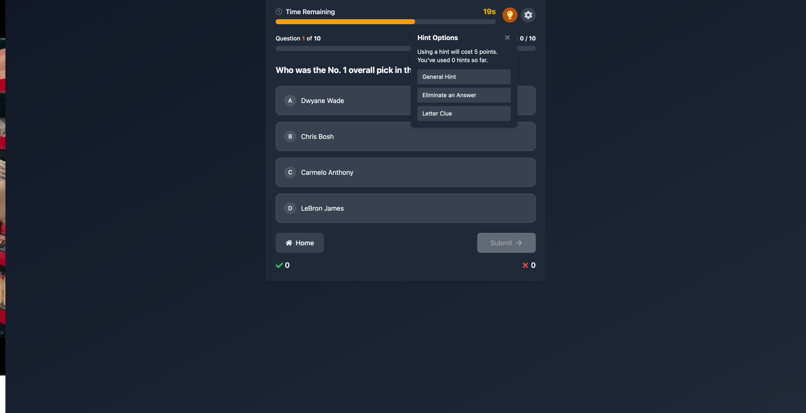
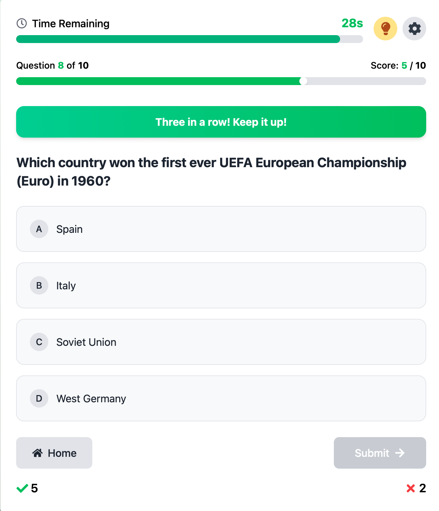
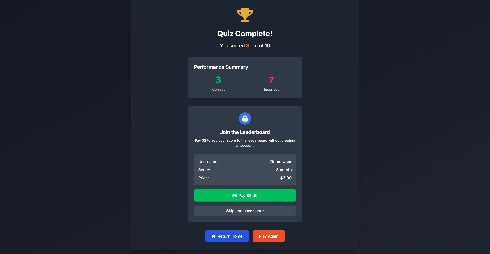

# trivia.ai: Interactive Sports Trivia Platform 🏀⚽

## Demo

Landing Page Signed In

Sing In/Sign Up

Loading Animation

Correct Answer

Leaderboard

Incorrect Answer

Hint

3 in a row streak

End Quiz Not Signed In

## 🚀 Project Overview

Trivia.AI is an advanced, interactive sports trivia application designed to provide users with an engaging and personalized quiz experience focused on **basketball** 🏀 and **soccer** ⚽. The platform combines rich trivia content with modern web technologies to create an **immersive learning environment** for sports enthusiasts. 🎯🔥

## 🎯 Core Purpose

The primary aim of trivia.ai is to deliver a **comprehensive sports knowledge platform** that:

1. **📚 Educates Users**: Provides factual, interesting, and challenging questions about basketball and soccer history, players, teams, championships, and current events.

2. **🤖 Personalizes Learning**: Adapts to user preferences and performance, offering a tailored experience based on difficulty preferences, sport selection, and question history.

3. **🎮 Gamifies Knowledge Acquisition**: Transforms sports learning into an engaging experience through **achievements 🏆, streaks 🔥, points 💰, and competitive elements**.

4. **👥 Builds Community**: Connects sports enthusiasts through **leaderboards 🏅, social features 🗣️, and shared achievements**.

---

## 🔥 Key Features

### ⚽🏀 Sport-Specific Content
- **Multi-Sport Support**: Dedicated question banks for both **basketball** 🏀 and **soccer** ⚽.
- **Categorized Questions**: Content organized by topics like **players, teams, history, championships, and current events**.
- **Varying Difficulty Levels**: Questions range from **easy 🤓 to hard 🧠** to accommodate all knowledge levels.

### 💡 User Experience
- **🎯 Personalized Recommendations**: Question selection based on **user performance and preferences**.
- **⚡ Adaptive Difficulty**: Dynamic adjustment of question difficulty based on user performance.
- **🎨 Sport-Specific Theming**: Visual design adapts based on selected sport (**orange** 🟠 for basketball, **green** 🟢 for soccer).
- **🌙☀️ Dark/Light Mode**: User-selectable interface theme.

### 🏆 Gamification Elements
- **🏅 Achievement System**: Unlockable badges and rewards for accomplishments.
- **📈 Progress Tracking**: XP-based leveling system with sport-specific progress.
- **🔥 Streak Mechanics**: Rewards for **consistent correct answers** and daily participation.
- **🎉 Visual Celebrations**: **Confetti animations 🎊 and visual feedback 🎇 for achievements**.

### 🔐 User Management
- **🔑 User Authentication**: Secure login with **email 📧 or Google authentication**.
- **⚙️ Preference Management**: Customizable settings for **difficulty, categories, and preferred sport**.
- **☁️ Progress Persistence**: **Cloud-based storage** of user achievements, scores, and preferences.

---

## 🛠️ Technical Implementation

Trivia.AI is built using **modern web technologies**:

- **🌐 Frontend**: Next.js 14 with App Router, React, TypeScript, and Tailwind CSS.
- **🔒 Authentication**: Firebase Authentication.
- **🗄️ Data Storage**: Firebase Firestore for **user data, preferences, and achievements**.
- **💫 Animation**: Framer Motion for **smooth UI transitions and celebrations**.
- **📱 Responsive Design**: **Mobile-first approach** ensuring compatibility across devices.

---

## 📖 Educational Value

Beyond entertainment, Trivia.AI serves as an **educational tool** that:

- 📜 Expands users' knowledge of **sports history and current events**.
- 🎯 Encourages **continuous learning** through daily challenges.
- ✅ Provides **immediate feedback** on answers with correct information.
- 🌍 Creates a **competitive yet supportive environment** for knowledge growth.

---

## 🌟 Future Vision

Trivia.AI aims to become the **premier platform for sports knowledge enhancement**, with plans to:

- **🏏 Expand to additional sports** beyond basketball and soccer.
- **🗣️ Implement more social features** to foster community interaction.
- **🧠 Develop advanced personalization algorithms** to further tailor the experience to each user's learning style and interests.

---

🎉 **Trivia.AI: Where Sports Knowledge Meets Interactive Learning!** 🚀🔥

